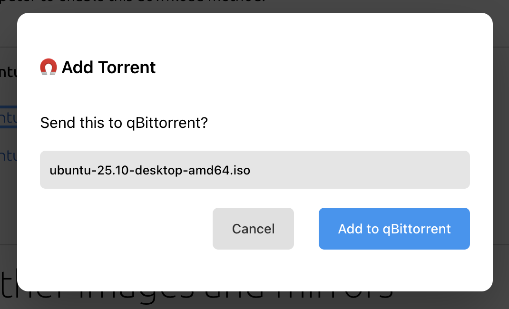
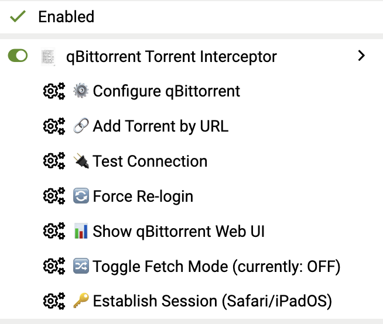

# qBittorrent Tampermonkey Interceptor

A Tampermonkey userscript that intercepts torrent file downloads and magnet links, automatically sending them to your qBittorrent server. This one works with Chrome, Firefox and Safari. The Safari support means that iOS and iPad OS users now have an option for loading torrents directly into their qbittorrent servers from websites. 

## Features

- **Magnet Link Interception** - Clicks on magnet links are captured and sent to qBittorrent
- **Torrent File Interception** - Downloads of `.torrent` files are intercepted and uploaded to qBittorrent
- **Download Locally** - Optionally save the `.torrent` file to your own computer instead of sending it to qBittorrent (magnet links can be opened in your default torrent app)
- **Authenticated Site Support** - Uses your browser's cookies to download torrents from sites requiring login
- **Confirmation Dialogs** - Optional confirmation before adding torrents
- **Toast Notifications** - Visual feedback when torrents are added
- **Configurable Settings** - Set your qBittorrent URL, credentials, save path, and category
- **Dark Mode Support** - UI adapts to your system theme
- **Safari Compatible** - Works with Safari on macOS, iOS, and iPadOS via Tampermonkey (on iOS/iPadOS the script signs in to qBittorrent for you in the background — no need to log in manually first)

## Prerequisites

1. **Tampermonkey Extension** - Install from the [Safari App Store](https://apps.apple.com/app/tampermonkey/id1482490089) (paid) or use [Userscripts](https://apps.apple.com/app/userscripts/id1463298887) (free alternative)

2. **qBittorrent with Web UI enabled**:
   - Open qBittorrent → Preferences → Web UI
   - Check "Web User Interface (Remote control)"
   - Set a port (default: 8080)
   - Set username and password
   - Optional: Enable "Bypass authentication for clients on localhost"

## Installation

### Method 1: Direct Install
1. Open the raw `qbittorrent-interceptor.user.js` file
2. Tampermonkey should detect it and offer to install
3. Click "Install"

### Method 2: Manual Install
1. Open Tampermonkey dashboard
2. Click the `+` tab to create a new script
3. Delete any existing content
4. Copy the entire contents of `qbittorrent-interceptor.user.js`
5. Paste into Tampermonkey
6. Press `Cmd+S` to save

## Configuration

After installation, configure your qBittorrent connection:

1. Click the Tampermonkey icon in Safari's toolbar
2. Click "Configure qBittorrent" under the script menu
3. Enter your settings:
   - **qBittorrent URL**: Your server address (e.g., `http://localhost:8080` or `http://192.168.1.100:8080`)
   - **Username**: Your qBittorrent Web UI username
   - **Password**: Your qBittorrent Web UI password
   - **Save Path** (optional): Default download location
   - **Category** (optional): Auto-assign category to added torrents

### Remote qBittorrent Server

If your qBittorrent runs on a different machine:

1. Ensure qBittorrent Web UI is accessible from your Mac
2. Check firewall settings allow the port
3. Use the remote IP address in settings (e.g., `http://192.168.1.100:8080`)

### HTTPS / SSL

If you access qBittorrent over HTTPS:
- Make sure your certificate is trusted by macOS
- Use `https://` in the URL

## Usage

### Automatic Interception

Once installed and configured, the script automatically:

1. **Magnet Links** - When you click any `magnet:` link, a dialog appears asking to send it to qBittorrent (or open it in your default torrent app)
2. **Torrent Files** - When you click a link to a `.torrent` file, it's downloaded using your current session cookies and sent to qBittorrent

The confirmation dialog offers a choice:
- **Add to qBittorrent** - Send the torrent/magnet to your qBittorrent server (the primary action)
- **⬇️ Download File** - Save the `.torrent` file directly to your computer (for torrent file links)
- **🧲 Open in App** - Hand the magnet link off to your system's default torrent client (for magnet links)

### Menu Commands

Click the Tampermonkey icon to access:

- **Configure qBittorrent** - Open settings dialog (includes Quick Actions for Force Re-login, Open Web UI, Sign in via Web UI, plus Fetch Mode and Debug Logging toggles)
- **Add Torrent by URL** - Manually enter a magnet or torrent URL
- **Test Connection** - Verify qBittorrent connectivity

### Authenticated Sites

For sites that require login (private trackers, etc.):

1. Log in to the site normally in Safari
2. Click torrent download links as usual
3. The script uses `GM_xmlhttpRequest` with `withCredentials: true`, which includes your session cookies automatically

The script will:
1. First try to download the `.torrent` file directly (using your cookies)
2. If that fails, fall back to sending the URL to qBittorrent (which will download it)

## Troubleshooting

### "Connection failed" Error

1. Check qBittorrent Web UI is enabled and running
2. Verify the URL is correct (include `http://` or `https://`)
3. Try accessing the URL directly in Safari
4. Check firewall isn't blocking the connection

### "Invalid username or password"

1. Double-check credentials in script settings
2. Verify the same credentials work in qBittorrent Web UI directly
3. If using localhost bypass auth, ensure you're actually on localhost

### Torrents Not Being Intercepted

1. The script runs on all sites (`@match *://*/*`)
2. Check Tampermonkey shows the script is enabled for the current site
3. Look for errors in Safari's Web Inspector console

### Authenticated Downloads Failing

1. Make sure you're logged into the torrent site
2. Try refreshing the page after logging in
3. Some sites use complex download mechanisms that may not be intercepted

### Safari-Specific Issues

1. **Permissions**: Safari may block cross-origin requests. Go to Tampermonkey preferences and ensure "Allow all hosts" is enabled
2. **Web Inspector**: Enable Developer menu (Safari → Preferences → Advanced → Show Develop menu) to debug issues

### iOS / iPadOS: how sign-in works

Safari extensions can't attach the qBittorrent session cookie to requests themselves, and on iOS/iPadOS the cookie from the script's own login never lands in Safari's cookie jar. Previously you had to open the qBittorrent Web UI in a tab and log in by hand before torrents would go through. The script handles this for you, trying the least intrusive option first.

**1. Silently, via the cookie API (preferred).** The script signs in to qBittorrent in the background, takes the `SID` out of the response, and writes it straight into the browser's cookie jar with `GM_cookie` — replaying the exact attributes qBittorrent sent (path, `HttpOnly`, `Secure`, `SameSite`). Nothing opens and nothing flashes on screen. This needs a userscript manager that grants `GM_cookie`; Tampermonkey asks for the cookie permission the first time, so **allow it** if prompted.

**2. A background tab.** If `GM_cookie` isn't available or is refused, the script opens the Web UI with `GM_openInTab` in a *background* tab, so focus stays on the page you're reading. The script instance on that page signs in same-origin (Safari stores the cookie), reports back, and the tab is closed. If it hasn't finished after ten seconds — an iOS background tab can be suspended — you'll get a prompt asking you to switch to it.

**3. A foreground tab.** Only if neither API exists. This is the old behaviour: the tab opens in front of you, signs in, and closes itself. Safari's pop-up blocker may stop it the first time, in which case you'll see a **Sign in to qBittorrent** prompt — tap **Open qBittorrent**.

You can trigger a sign-in manually from **Configure qBittorrent → Sign in via Web UI**, and **Force Re-login** clears the session and re-tests the silent path.

If the automatic sign-in fails (e.g. wrong credentials), the qBittorrent tab stays open on its login page so you can log in by hand, then go back and tap **Retry**. The sign-in repeats whenever the qBittorrent session expires (qBittorrent's Web UI session timeout, 1 hour by default — raise it in qBittorrent → Options → Web UI to see it less often). If your server is only reachable on your LAN, **Options → Web UI → Bypass authentication for clients in whitelisted IP subnets** removes the sign-in entirely.

## Security Notes

- Your qBittorrent credentials are stored locally by Tampermonkey using `GM_setValue`
- The `@connect *` permission allows the script to connect to any host (required for various torrent sites)
- Never share your configured Tampermonkey script as it may contain your credentials

## License

MIT License - See [LICENSE](LICENSE) file
